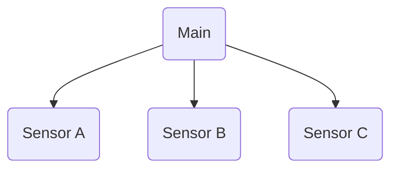

# czujniki i program odczytujący
Projekt na ZUT (Shm/Semafore)

# Plik main:

Funkcje:

tu jest tworzona pamięć dzielona (shm_id) która pozwala na zapisywanie wielu rużnych tablic znaków:

```C
    shm_id = shmget(0x0316316, (SIZE+1)*sizeof(char), IPC_CREAT|0600);
    if (shm_id == -1){perror("ERROR creating shared memory segment");exit(1);}
```

```C
shmget(<Wartość_Klucza_do_pamięci>, <8 bitów * ilość_znaków + 1 zna_ kończący>, <łączy_Uprawnienia_do_zapisu_i_odczytu>);
```

<br />

Przypisujemy do zmiennych shared pointer(adres do komurki 'Odnośnik') którym będziemy się posługiwać:

```C
    shared = (char*)shmat(shm_id, NULL, 0);
    if (shared == NULL){perror("ERROR attaching shared memory segment");exit(1);}
```

<br />

Po koleji:
+ usuwamy wrzystkie semafory który odnoszą się do nazwy semafora "sem_fn"
+ Tworzymy semafor i ustawiamy mu uprawnienia do zapisu/odczytu (O_CREAT, 0644)
+ sprawdzamy czy pomyślnie został stworzony semafor, jeżeli nie to zamykamy program
+ nadajemy sygnał post który do wartości Default:0 semafora dodaje 1

```C
    //semafor
    sem_unlink(sem_fn);
    sem_des = sem_open(sem_fn, O_CREAT, 0644, 0);
    if(sem_des == (void*)-1){perror("sem_open failure");_exit(-1);}
    sem_post(sem_des);
```




<details><summary>Program Main.C</summary>


Po uruchomieniu programu:
+ Wpisujemy PID czujników aby uzyskać status ich aktywności
+ następnie nasz program odświeża co 1 sekundę parametry z czujników

```Bash
USER@DESKTOP-ABC123:~/projekt$ ./p1
podaj pid sensora A: 12109
podaj pid sensora B: 12134
podaj pid sensora C: 12165
----status----
sensorA: Status: 1       val: 0
sensorB: Status: 1       val: 0
sensorC: Status: 1       val: 0
```
</details>

<details><summary>Program Sensor<n>.C</summary>
    
Po uruchomieniu programu wyświetla się PID programu który trzeba przepisać do programu main aby uzystać status z czujników
    <b>nie trzeba podawać PID aby program Main odczytywał wartość</b>

```Bash
USER@DESKTOP-ABC123:~/projekt$ ./p2
-----------Sensor A----------PID:        pid: 12109
podaj wartość: 10
Wartość zapisana:
```

    Program działa w pętli i przy każdej zmianie wartości pyta się o ponowne podanie wartości.
    
</details>
